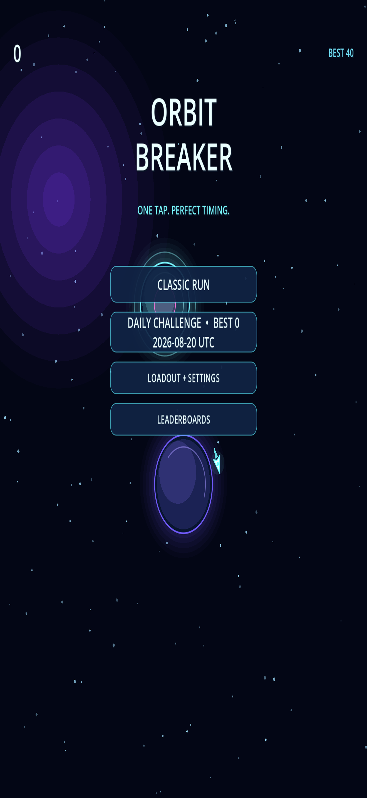
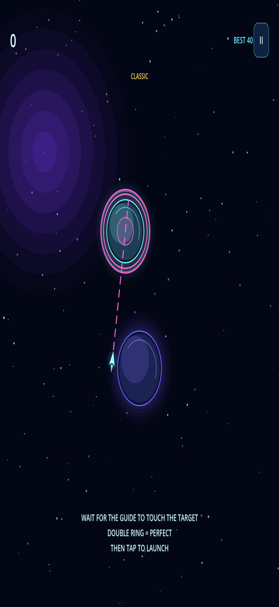
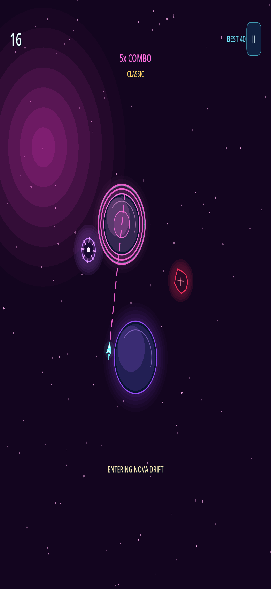
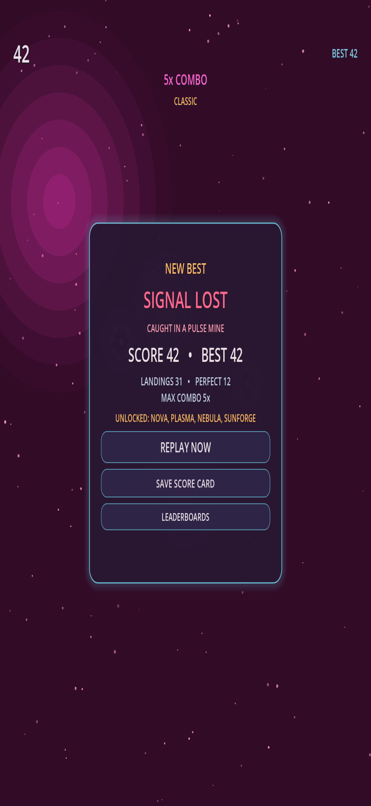

# Orbit Breaker

Orbit Breaker is a fast portrait arcade game for iPhone. Tap at the right moment to launch from one orbit to the next, build a perfect-landing combo, avoid hazards, and climb the daily and all-time leaderboards.

## Features

- One-tap orbit and launch gameplay
- Classic endless runs and a deterministic daily challenge
- Perfect landings with a combo multiplier up to 5x
- Asteroids and pulse mines with verified safe launch windows
- Three changing space zones
- Skill-based ship, trail, and planet-theme unlocks
- Persistent scores, settings, accessibility preferences, and progression
- Game Center all-time, weekly, and daily leaderboards
- Game Center achievements
- Original adaptive music, polished sound effects, haptics, particles, and screen feedback
- Shareable end-of-run score cards
- Local, privacy-preserving playtest metrics

On iPhone, saved score cards and explicitly exported playtest reports appear in **Files > On My iPhone > Orbit Breaker**. The game does not request access to the photo library.

## Controls

- iPhone: tap to start and launch
- Editor: left click or Space to start and launch
- Use the pause control during a run for resume, restart, and settings
- Open Privacy or Support from Loadout + Settings

## Requirements

- Godot 4.7.2
- macOS and Xcode for iOS exports
- iOS 17 or newer with the currently bundled Game Center frameworks
- An Apple Developer team for device signing and TestFlight

## Run locally

1. Open `project.godot` in Godot 4.7.2.
2. Run the main scene.
3. Choose Classic Run or Daily Challenge.

Run the automated suite:

```sh
godot --headless --path . --script res://tests/test_runner.gd
```

If the macOS app binary is not on `PATH`, run:

```sh
/Applications/Godot.app/Contents/MacOS/Godot \
  --headless --path . --script res://tests/test_runner.gd
```

A successful run prints `ORBIT_BREAKER_TESTS_OK` and exits with status 0.

## iOS export

1. Install the matching Godot 4.7.2 iOS export templates.
2. Open **Project > Export > iOS**.
3. Confirm the signing team and bundle identifier.
4. Export to `build/ios/Orbit Breaker.xcodeproj`.
5. Run `tools/prepare_ios_export.sh build/ios` to remove empty Godot-generated entitlement and privacy keys, then validate iOS 17 and the native frameworks.
6. Configure the Game Center identifiers listed in [Game Center configuration](marketing/game-center-configuration.md) in App Store Connect.
7. Archive and upload the build from Xcode.

The native Godot Apple Game Center extension is included for iPhone and simulator builds. Game Center degrades safely when it is unavailable.

The Godot export preset and both bundled native frameworks require iOS 17.0 or newer. Supporting iOS 16 requires compatible rebuilt frameworks and a matching preset change.

The installed Godot 4.7.2 release template supplies an x86_64-only simulator engine library. A generic iPhone device build succeeds for arm64, and the simulator build succeeds when `ARCHS=x86_64` is selected. Replace the export template before requiring a native arm64 simulator build.

## Release resources

- [Privacy policy](PRIVACY.md)
- [Support](SUPPORT.md)
- [App Store metadata](marketing/app-store-metadata.md)
- [Game Center configuration](marketing/game-center-configuration.md)
- [TestFlight validation plan](marketing/testflight-validation.md)
- [App preview storyboard](marketing/app-preview-storyboard.md)
- [Detailed release checklist](docs/RELEASE_CHECKLIST.md)
- [Accessibility communication audit](docs/ACCESSIBILITY_AUDIT.md)
- [Detailed TestFlight protocol and session log](docs/TESTFLIGHT_PLAN.md)
- [Screenshot capture plan](docs/SCREENSHOT_PLAN.md)

## Screenshots

| Ready screen | Perfect launch |
| --- | --- |
|  |  |
| Nova hazards | End-of-run score card |
|  |  |

These 1320 by 2868 RGB captures use a supported 6.9-inch App Store screenshot size and contain no alpha channel.

## Generated files

Godot cache data and iOS build output are ignored. Source assets, tests, native iOS Game Center libraries, and release materials are versioned.

## License

Orbit Breaker is distributed under the terms in [LICENSE](LICENSE). Third-party components retain their own licenses as described in [THIRD_PARTY_NOTICES.md](THIRD_PARTY_NOTICES.md).
